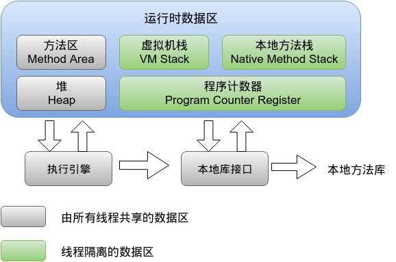

Java内存区域
===========

## 程序计数器
`Program Counter Register`:保存各线程执行的行号,保证线程切换和分支循环等跳转的执行顺序.如果执行的是native方法,计数器值为空(undefined).

唯一一个没有规定任何OutOfMemoryError的内存区域.

## Java虚拟机栈(Java方法栈)
`Java Virtual Machine Stacks`:每个线程的每个方法执行时创建一个栈帧,保存该方法使用到的局部变量表,操作数栈,动态链接,方法出口等信息.

线程请求的方法栈深度大于允许深度,抛出StackOverflowError,但一般VM实现都是可动态扩展的,一直到无法申请到足够内存,抛出OutOfMemoryError.

## 本地方法栈(native方法栈)
`Native Method Stack`:与Java虚拟机栈作用一致,该栈保存调用的native方法.

## Java堆
`Java Heap`:存放对象实例,几乎所有的对象实例及数组都在这里分配内存.

为了更快分配和回收内存,这块内存区域还被细分为:Eden,From Survivor,To Survivor等.

一般VM实现上这块区域都是可扩展的,通过参数设置. `-Xms`初始堆大小, `-Xmx`最大堆大小.

## 方法区
`Method Area`:可以理解成静态区,保存类信息常量,静态变量等数据.但是他的数据是在类被加载后才分配内存的,类需要回收的时候这部分内存也才随之回收,和堆一样是线程共享的,可看作堆的逻辑部分.常量数据在类被加载后,放置方法区的运行时常量池中.

## 直接内存
直接向操作系统申请内存空间,这是独立于VM内存的.比如NIO使用Native函数库直接分配堆外内存,避免数据在Java堆和Native堆中来回复制影响效率.